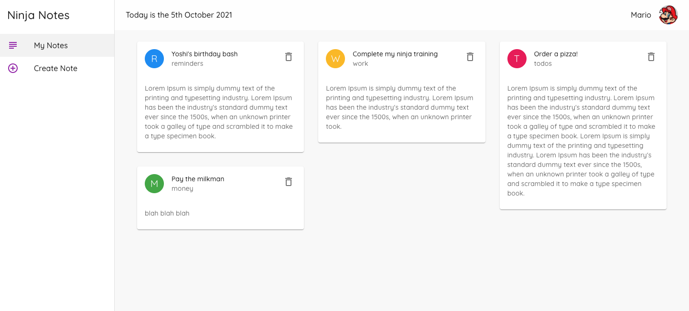

# Material UI Tutorial

## 📖 Chapters

1. Intro & Setup
1. Typography
1. Buttons
1. Icons
1. makeStyles Hook (Custom CSS)
1. Custom Themes
1. Text Fields
1. Radio Buttons
1. Using JSON Server
1. Grid System
1. Card Components
1. Layout Component
1. Permanent Drawer
1. Lists & List Items
1. More on makeStyles
1. App Bars
1. Avatars
1. React Masonry CSS (masonry layout)

## ⚙️ Technologies

  
  

